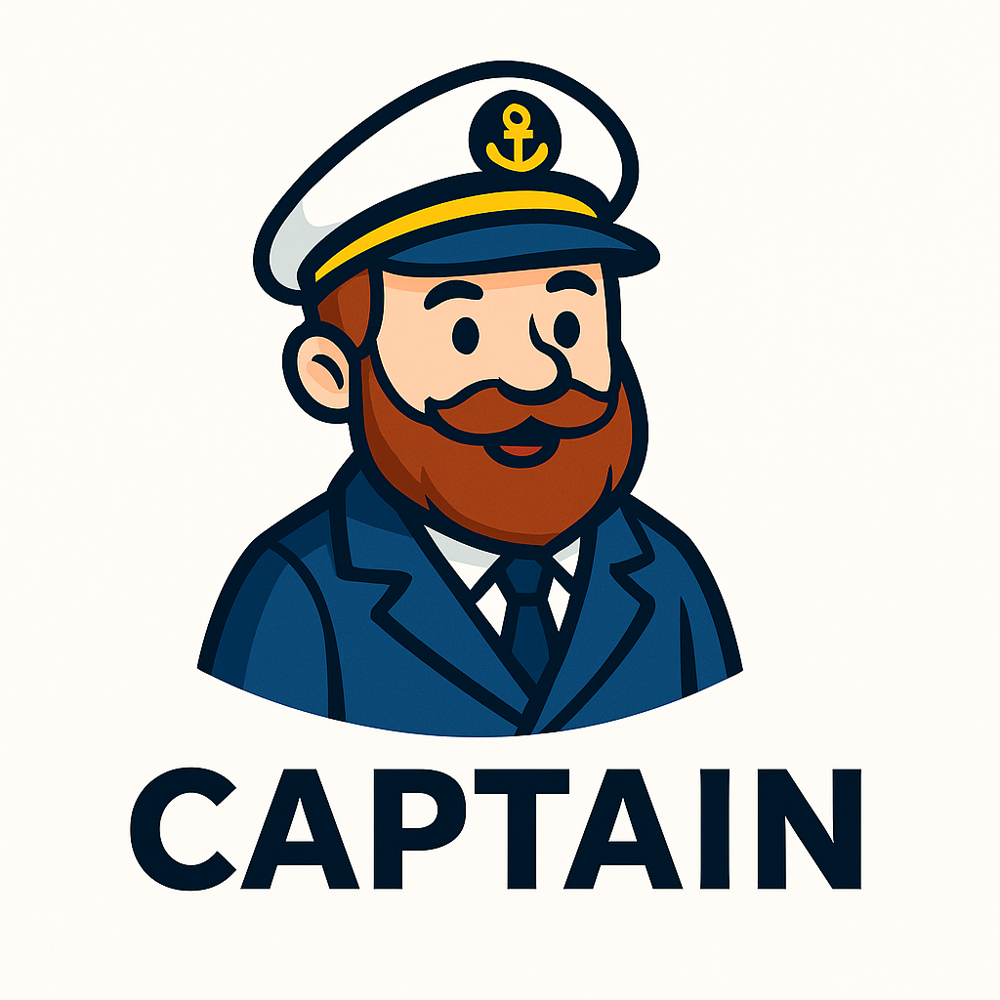

# Captain



**Captain** is a command-line tool that automatically discovers all Docker Compose projects inside one or more directory trees and lets you manage them from anywhere — without `cd`, without wrapper scripts, and without repetitive docker commands.

This repository is a modernized fork of the original project by **jenssegers**, extended and refactored to be more robust, more maintainable, and more powerful.

---

## ✨ Features

### 🔍 Automatic project discovery

Captain recursively searches your defined root directories for the following files:

* `docker-compose.yml`
* `docker-compose.yaml`
* `compose.yml`
* `compose.yaml`

Every directory containing one of these files is treated as a project — no configuration required.

---

### 🐳 Manage Docker Compose projects from anywhere

```bash
captain up myservice
captain down myservice
captain restart blog
captain logs traefik
captain exec postgres psql -U user
captain run redis redis-cli
captain ps myservice
```

Captain automatically:

* switches to the correct project directory
* chooses the correct Docker Compose command
* loads additional environment files
* forwards your arguments and STDIN/STDOUT properly

---

### 💨 Fuzzy matching for project names

You don’t need exact project names:

```bash
captain up tra   # might match "traefik"
captain logs pos # likely matches "postgres"
```

Captain picks the best match automatically.

---

### 📂 Multiple project roots

By default Captain scans your `$HOME` directory.

You can specify multiple roots:

```bash
export CAPTAIN_ROOTS="$HOME/dev:$HOME/docker:$HOME/services"
```

Captain scans each root and merges all detected projects into one list.

---

### 📁 Limit directory depth

```bash
export CAPTAIN_DEPTH=4
```

This prevents scanning large or irrelevant directory trees.

---

### 🔐 Extended .env support

Docker Compose automatically loads `.env`, but Captain lets you define additional environment files globally or per command.

#### Global additional env-files:

```bash
export CAPTAIN_ENV_FILES=".env.common:.env.secrets"
captain up blog
```

#### Per command:

```bash
captain up blog --env-file .env.local
```

Relative paths are resolved against the project directory.

---

### 🩺 Debug mode

```bash
CAPTAIN_DEBUG=1 captain up blog
```

Shows:

* discovered projects
* ignored/blacklisted paths
* executed docker commands
* loaded environment files

---

## 📦 Installation

### Install via Go

```bash
go install github.com/tkaefer/captain/cmd/captain@latest
```

### Build from source

```bash
git clone https://github.com/tkaefer/captain
cd captain
make
sudo mv captain /usr/local/bin
```

---

## 🧰 Usage Examples

List discovered projects:

```bash
captain ls
```

Typical project list output:

```
Discovered projects:
  traefik                      /home/user/docker/traefik
  blog                         /home/user/docker/blog
  postgres                     /home/user/services/postgres
```

Start a project:

```bash
captain up blog
```

Stop a project:

```bash
captain down blog
```

Show logs for a specific service:

```bash
captain logs traefik
```

Pass commands through to containers:

```bash
captain exec postgres psql -U admin
```

Run one-off tasks:

```bash
captain run redis redis-cli
```

Restart (down + up):

```bash
captain restart blog
```

---

## ⚙️ Configuration

### Environment variables

| Variable              | Description                                                                                 |
| --------------------- | ------------------------------------------------------------------------------------------- |
| `CAPTAIN_ROOTS`       | Colon-separated list of directories to scan for projects                                    |
| `CAPTAIN_ROOT`        | Single root directory (fallback)                                                            |
| `CAPTAIN_DEPTH`       | Maximum directory scan depth (default: `5`)                                                 |
| `CAPTAIN_COMPOSE_CMD` | Override the docker compose command (`docker compose`, `docker-compose`, custom wrapper, …) |
| `CAPTAIN_ENV_FILES`   | Extra `.env` files to load for all commands (colon-separated)                               |
| `CAPTAIN_DEBUG`       | Enable verbose logging                                                                      |

---

## 🏗 Makefile

The repository includes a simple Makefile:

```Makefile
BINARY=captain

all: build

build:
	go build -o $(BINARY) ./cmd/captain

clean:
	rm -f $(BINARY)
```

Build using:

```bash
make
```

---

## 🔧 Project Structure

```
cmd/
  captain/
    main.go
internal/
  config/
    config.go
  projects/
    projects.go
  compose/
    compose.go
Makefile
README.md
go.mod
```

---

## 💡 Why Captain?

Without Captain, you need:

```bash
cd ~/docker/myproject
docker compose up -d
```

With Captain:

```bash
captain up myproject
```

Captain saves time, reduces cognitive load, and keeps multi-Compose setups clean and easy to manage — without daemons, agents, or UI overhead.
